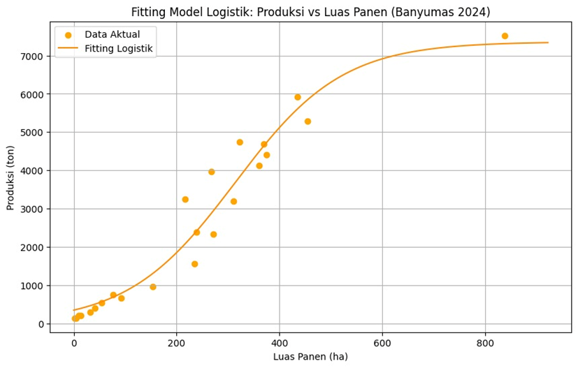

# 🌱 Agricultural Modeling: Coconut Sap Production Analysis


> **Penerapan Model Pertumbuhan Logistik untuk Estimasi Kapasitas Produksi Kelapa Deres di Kabupaten Banyumas.**

## 📖 Latar Belakang

Kabupaten Banyumas merupakan sentra produksi gula kelapa (kelapa deres). Namun, fluktuasi produksi dan keterbatasan lahan menjadi tantangan utama. 

Proyek ini bertujuan untuk membangun model matematis yang dapat memprediksi **Kapasitas Maksimum (Carrying Capacity)** produksi dan menentukan strategi pengembangan lahan yang optimal (antara ekstensifikasi vs intensifikasi) menggunakan pendekatan data-driven.

## 🛠️ Metodologi

Penelitian ini menggunakan pendekatan kuantitatif dengan **Model Pertumbuhan Logistik** (Verhulst Model):

$$Y(X) = \frac{K}{1 + e^{-r(X - X_0)}}$$

Dimana:
* **X**: Luas Panen (Ha)
* **Y**: Produksi (Ton)
* **K**: Kapasitas Maksimum
* **r**: Laju Pertumbuhan

**Teknik Analisis:**
1.  **Data Preprocessing:** Pembersihan data sekunder BPS & Dinas Pertanian 2024.
2.  **Curve Fitting:** Menggunakan metode *Nonlinear Least Squares Fitting (NLSF)* dengan algoritma Levenberg-Marquardt di Python (`scipy.optimize.curve_fit`).
3.  **Evaluasi Model:** Menggunakan metrik $R^2$, RMSE, dan MAE.

## 📊 Hasil Analisis

Berdasarkan fitting data terhadap 23 kecamatan di Banyumas, diperoleh model empiris:

$$Y(X) = \frac{7360.80}{1 + e^{-0.0096(X - 313.80)}}$$

**Insight Utama:**
* **Akurasi Tinggi:** Model memiliki nilai **$R^2$ = 0.9483**, artinya 94.8% variasi produksi dapat dijelaskan oleh luas lahan.
* **Batas Produksi (K):** Produksi maksimal alami diprediksi akan jenuh di angka **7.360 Ton**.
* **Titik Belok ($X_0$):** Efisiensi lahan berubah pada luas **313.80 Ha**.

## 📈 Visualisasi Model



> *Gambar: Kurva Sigmoid (Garis Oranye) menunjukkan fitting yang sangat sesuai dengan sebaran data aktual (Titik Kuning).*

## 💡 Rekomendasi Kebijakan

Berdasarkan titik belok ($X_0 = 313.8$ Ha), direkomendasikan strategi terpisah:
1.  **Kecamatan dengan Luas < 313 Ha:** Prioritas **Ekstensifikasi** (Perluasan Lahan) karena laju pertumbuhan masih eksponensial.
2.  **Kecamatan dengan Luas > 313 Ha:** Prioritas **Intensifikasi** (Peremajaan pohon/Teknologi), karena penambahan lahan tidak lagi memberikan kenaikan produksi yang signifikan (Law of Diminishing Returns).

## 💻 Cara Menjalankan Code

1.  Clone repository ini.
2.  Install library yang dibutuhkan:
    ```bash
    pip install pandas numpy matplotlib scipy scikit-learn
    ```
3.  Jalankan file notebook/script:
    ```bash
    python logistic_modeling.py
    ```

---
### 👥 Tim Peneliti
Proyek ini disusun oleh Kelompok 10 (Program Studi Matematika, Universitas Jenderal Soedirman):
* Maya Ariyanti
* Dian Prasetiyo Rahman
* Nis Riina Azzahra Shiyami
* **Abdur Rochman Azis**

---
*Data Source: Dinas Pertanian dan Ketahanan Pangan Kabupaten Banyumas (2024)*
